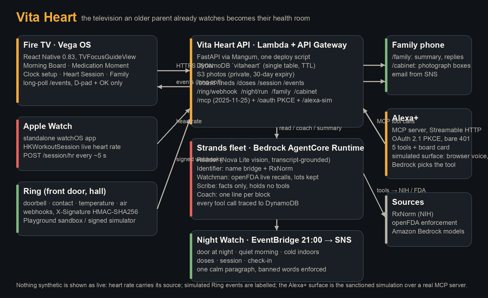

# Vita Heart

**The television an older parent already watches becomes their health room.**

A Fire TV app on Vega OS for an older adult living alone, with the family on their phones,
Alexa+ in the loop, Ring sensors at the door, and a fleet of Strands agents on Amazon Bedrock
AgentCore behind it. Built for *Build, Ship, Shape: Amazon Developer Hackathon* (Fire TV track,
Alexa+ track, AWS Builder and Open Source mini challenges) by Tahsin Bayraktar, Graviti Labs.

Live API: `https://rrjb1x8j2b.execute-api.eu-north-1.amazonaws.com` · demo household `AHMET1`

| Surface | What it does | Where |
|---|---|---|
| Fire TV (Vega OS, React Native 0.83) | Morning Board, Medication Moment, Clock setup, Heart Session with live wrist heart rate, Family | `tv/` |
| Phone pages | Photograph the boxes (`/cabinet`), family summary and replies (`/family`) | `api/vitaheart/web/` |
| Apple Watch | Standalone watchOS app streaming heart rate into the TV's session | `watch/` |
| Alexa+ | MCP server (spec 2025-11-25, Streamable HTTP, OAuth 2.1 PKCE), five tools, board card; simulated surface with browser voice at `/alexa-sim` | `alexa/` |
| Ring | Signed webhooks, sensors normalised, Night Watch rules (door at night, quiet morning, cold indoors) | `api/vitaheart/ring.py`, `api/vitaheart/night/` |
| AWS | Lambda + API Gateway, DynamoDB, S3, SNS, EventBridge; Strands agents on Bedrock AgentCore Runtime (Nova Lite reads, Claude writes) | `api/`, `agents/`, `scripts/deploy.py` |

## Run it

```bash
# API and agents (Python 3.12+)
uv venv .venv && uv pip install --python .venv/bin/python -r api/requirements.txt -r agents/requirements.txt
.venv/bin/python -m pytest -q tests                     # 37 tests, no AWS needed (moto)
VITAHEART_LIVE=1 .venv/bin/python -m pytest -q tests    # + live Bedrock / RxNorm / openFDA tests
cd api && ../.venv/bin/uvicorn vitaheart.app:asgi --reload   # local API on :8000 (uses your AWS profile for DynamoDB)

# Television (Vega Developer Tools installed, Virtual Device running)
cd tv && npm install && npm test && npm run build:debug
vega run-app build/aarch64-debug/vitahearttv_aarch64.vpkg

# Cloud
.venv/bin/python scripts/deploy.py        # Lambda, API Gateway, DynamoDB, S3, SNS, EventBridge (idempotent)
.venv/bin/agentcore deploy                # the Strands fleet on AgentCore Runtime
.venv/bin/python scripts/demo_setup.py    # the state the demo starts from
```

The TV's API URL lives in `tv/src/config.ts`; `scripts/deploy.py` writes the current one to `docs/URLS.md`.

## How it fits together



- **Every mutation lands on one events channel** (`/events`, long-poll). The TV, the family page and Alexa+ all read the same truth within a second. Lambda behind API Gateway cannot stream, so long-poll is used deliberately, not SSE.
- **Medicines are read, then identified, then checked.** Nova Lite reads what is printed (and must quote its own transcript, so a blank photo cannot become "Ibuprofen 200 mg"); RxNorm confirms identity through a Turkish-brand to INN bridge; openFDA supplies live recalls with lot numbers; dosing words become *slots*, and the household maps slots to its own clock on the TV once. Nothing invents 09:00.
- **The fleet is Strands on AgentCore**: Identifier, Watchman, Scribe (holds no tools, by design), Coach. Every tool call is written to a trace the TV and the family page show.
- **Night Watch** runs at 21:00 (EventBridge): Ring signals, doses, the check-in and the session become calm sentences for the family. The words alarm, monitor, detect and diagnose never appear.
- **Alexa+**: the MCP server runs inside the API; anonymous calls get a bare 401; tokens come from OAuth 2.1 PKCE where the "login" is the household code from the TV. Tool calls take 120 to 160 ms behind API Gateway.

## Honesty notes

- Heart rate on the TV is labelled by source: *live from your Watch*, *recorded session* or *test signal*. Replays refuse to join a session with a different label.
- Ring events in the demo come from `scripts/ring_simulate.py`, signed with the app's HMAC key exactly as Ring would sign them; the video says so.
- The Alexa+ MCP Toolkit is partner-only today; the surface at `/alexa-sim` is the hackathon's sanctioned simulated path, and the MCP server behind it is real.
- `agents/vendored/` is copied from our VitaCabinet (Apache-2.0) with attribution; everything else was written during the submission window. Vita, our shipping iOS app, is not part of this submission.

## More

`docs/MASTER-PLAN.md` (phases, judging map) · `docs/TESTING.md` (for judges) · `docs/DECISIONS.md` · `docs/FRICTION-LOG.md` · `docs/PRODUCT-FEEDBACK.md`

Apache-2.0.
